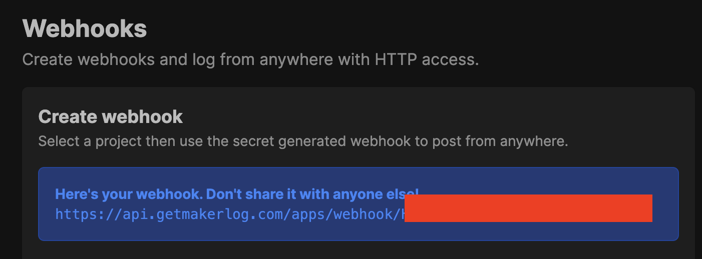
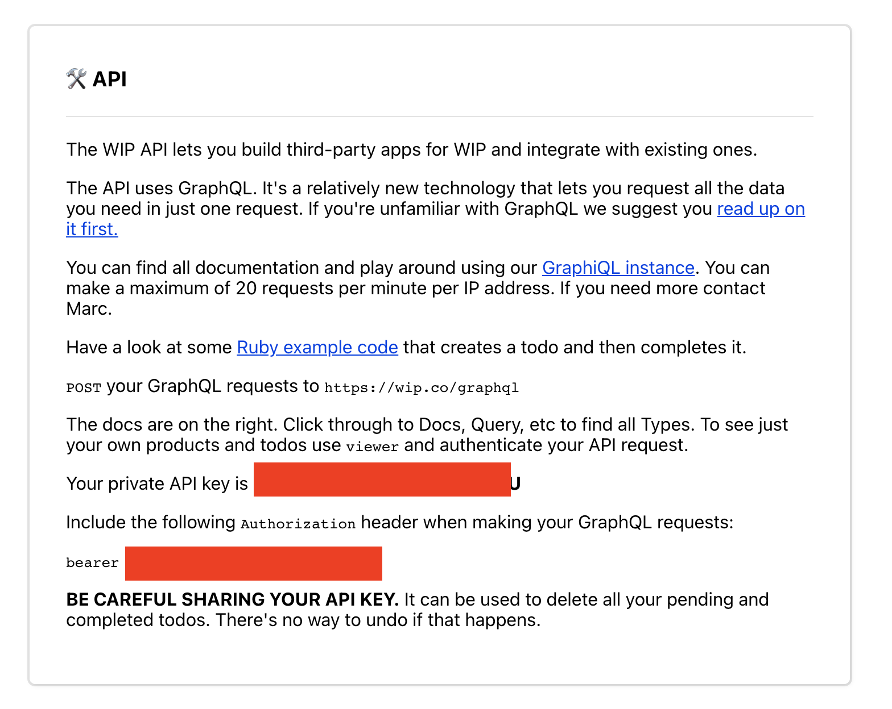

# 👨‍🌾 Maker

## Modifier

Cela te permet de modifier ton compte Maker, voici les valeurs que tu peux modifier :

* **photo**: L'url vers ta photo
* **emoji**: Un emoji qui te représente
* **couverture**: L'url vers ta photo de couverture
* **couleur**: Une couleur en Hexa qui te ressemble
* **nom**: Ton nom de scène ! 
* **bio**: Ta bio, qui te décrit 
* **website**: L'url de ton site perso \(avec https://\)
* **github**: L'url de ton github perso \(avec https://\)
* **makerlog:** L'url de ton compte getmakerlog.com perso \(avec https://\)
* **wip**: L'url de ton compte wip.co perso \(avec https://\)
* **twitter**: L'url de ton compte twitter.com perso \(avec https://\)
* **nomadlist**: L'url de ton compte nomadlist.com perso \(avec https://\)
* **makerlog\_hook**: L'url de ton webhook [makerlog](https://getmakerlog.com/)
* **wip\_key**: Ton api key pour connecter ton compte [wip.co](https://wip.co/)

```text
/im maker modifier emoji: 👷‍♂️
```


Astuce: pour utiliser un champ clique dessus ou écris son nom puis "**:**" et utilise la touche **TAB**


### Makerlog\_hook

La Makerlog hook permet d’envoyer automatique toutes tes taches faites sur un projet dans [makerlog](https://getmakerlog.com/).  
Pour que ca marche tu dois avoir configuré les même hashtag avec tes projets, et le projet doit être déjaà crée.  
Pour l'obtenir cette URL, rend toi ici :





Crée un webhook sans projet, copie l'URL et ajoute là ton profil via le bot, cette URL ne sera jamais affichée dans ton profil public.

### Wip\_key

La WIP key permet d’envoyer automatique toutes tes taches faites sur des projets dans [wip](https://wip.co/). Pour que ça marche, tu dois avoir configuré les mêmes hashtags avec tes projets Pour l'obtenir, va ici :





Et tu crées un webhook sans projet !

Copie l'api key et ajoute a ton profil via le bot, cette Api key ne sera jamais affichée dans ton profil public.

## Voir @Mention

Cela te permet de voir le karma d'un Maker

```text
/im maker voir maker: @martindonadieu
```

## Liste

Cela te permet de voir la liste de tous les Markers du server

```text
/im maker liste
```

## 🔥 Flammes

Cela te permet de voir le classement des 10 premiers Markers, classé par flammes !


Elles correspondent aux nombres de jours consécutifs depuis lequel tu postes des taches sur ton projet, si tu loupes un jour, le bot fera repartir ton compteur à Zero 😢.

Même une tâche qui prend 5 minutes par jour compte ! 5\*365/60 = **30 heures** à la fin de l'année dédié à ton projet !



Chaque Maker a un compteur global, plus un compteur de flammes par projet, pour qu'on soit régulier sur chaque projet !


```text
/im maker flammes
```

