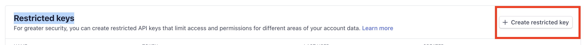
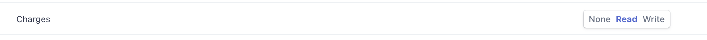
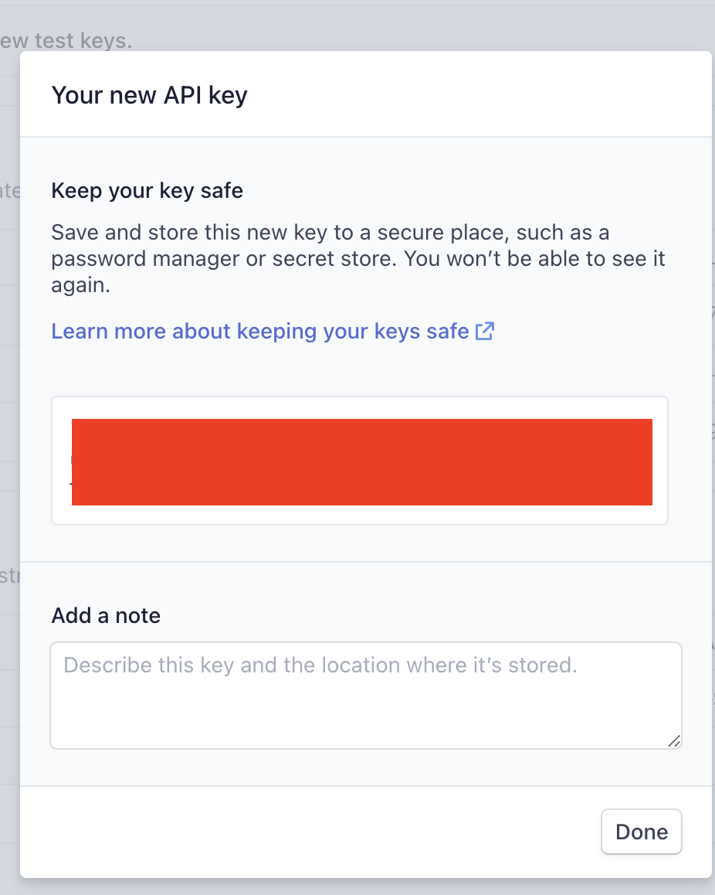

# 🪴 Projet

## Ajouter :hashtag

Le **hashtag** est un mot seulement composé de lettre sans espace ni caractères spéciaux, il servira a identifier ton projet et doit être unique.

```text
/im projet ajouter hashtag: indiemaker
```

## Modifier :hashtag

Cela te permet de modifier ton compte Maker, voici les valeurs que tu peux modifier :

* **logo**: L'URL vers le logo de ton projet
* **couverture**: L'URL vers l'image de couverture de ton projet
* **emoji**: Un émoji qui représente ton projet
* **color**: Une couleur en [Hexa](https://www.color-hex.com/) pour ton projet
* **nom**: Le nom de ton projet
* **description**: La description de ton projet
* **mois:** Mois de création 
* **année**: Année de création 
* **website**: L'url de ton site perso \(avec https://\)
* **categorie:** La catégorie de ton projet, les valeurs possible sont :
  * Saas
  * Application
  * Communauté
  * Newsletter
  * Formation
  * Template
  * Ecommerce
  * Autre
* **stripe\_key**: Ta clé api [stripe](https://dashboard.stripe.com/apikeys)
* **github**: Lien vers l'URL Github du projet \(avec https://\)
* **open\_source**: Le projet est il open-source?
  * Oui
  * Non

```text
/im projet modifier hashtag: indiemaker emoji: 🔥
```


Astuce: pour utiliser un champ clique dessus ou écris son nom puis "**:**" et utilise la touche **TAB**


Les valeurs peuvent se cumuler :

```text
/im projet modifier hashtag: indiemaker emoji: 🔥 color: #fff
```

### Stripe\_key

La stripe key permet de récupérer automatique toutes Les ventes passées sur ton projet pour les ajouter aux revenues.

Une fois l'initialisation faite, tes revenues serons mis à jour tous les lundi a 9h pour le mois en cours !  
Pour l'obtenir, rendez-vous ici :



Crée une **Restricted keys :**



Avec les droits **Charges** en lecture seule.





## Liste

Cela te permet de voir la liste de tous tes projets

```text
/im projet liste
```

## Liste @Mention

Cela te permet de voir la liste de tous les projets d'un Maker

```text
/im projet liste maker: @martindonadieu
```

## Voir :hashtag

Cela te permet de voir un projet qui t'appartient

```text
/im projet voir hashtag
```

## Voir :hashtag @Mention

Cela te permet de voir un projet d'un autre maker

```text
/im projet voir hashtag: indiemakers maker: @martindonadieu
```

## Supprimer :hashtag

Cela te permet de supprimer un projet qui t'appartient

```text
/im projet supprimer: indiemaker
```

